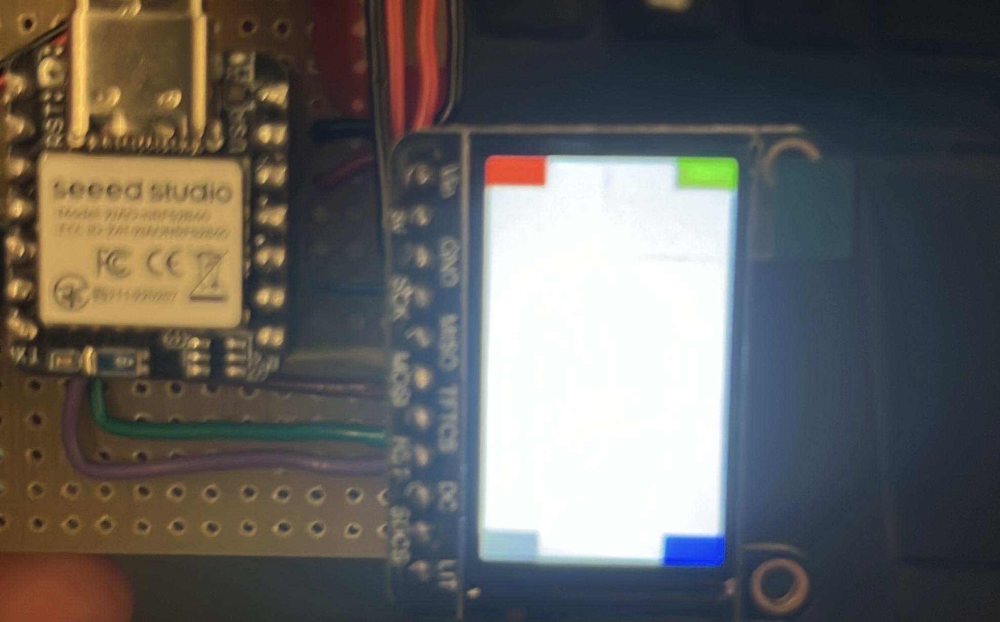

# Zephyr display integration
This project demonstrates how to include the display driver to a zephyr project.
The project uses:
- [xiao nrf52840](https://wiki.seeedstudio.com/XIAO_BLE/) / `xiao_ble`
- [adafruit 240x135 Color TFT](https://learn.adafruit.com/adafruit-1-14-240x135-color-tft-breakout)

Build with `$ west build -b xiao_ble`. 
See `boards/` for overlay file. 

